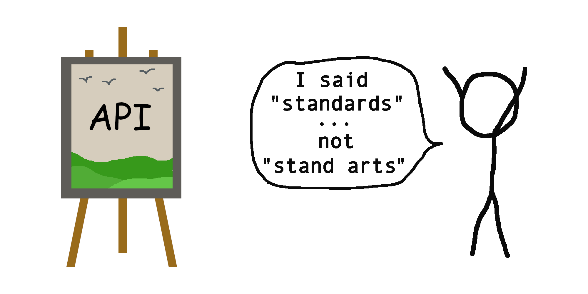

<p align="center">
  <br>
  <br>
  
  <br>
  <br>
</p>

# 🌩 API Standards

This library provides utilities for creating end to end type safe APIs.

The library advocates:

- API response envelopes
- Error handling with [RFC 7807 Problem Details 🔗](https://www.rfc-editor.org/rfc/rfc7807)

# 📖 Table of contents

<!-- TOC -->
* [🌩 API Standards](#-api-standards)
* [📖 Table of contents](#-table-of-contents)
* [📦 NPM Package](#-npm-package)
* [💾 Installation](#-installation)
* [🏁 Goal](#-goal)
* [📑 Documentation](#-documentation)
  * [⚠️ Problem Details](#-problem-details)
  * [📨 Response Envelopes](#-response-envelopes)
* [📜 Changelog](#-changelog)
* [🦔 Author](#-author)
<!-- TOC -->

# [📦 NPM Package](https://www.npmjs.com/package/@tectonique/api-standards)

# 💾 Installation

Using npm:
```bash
npm i @tectonique/api-standards
```

Using yarn:
```
yarn add @tectonique/api-standards
```

# 🏁 Goal
The goal of the library is to help you create type safe code like this:
```typescript
import { ResponseEnvelopes } from "@tectonique/api-standards"

// Import response and error (problem detail) types
import { ProblemDetailSuperType } from "@backend/ProblemDetailSuperType"
import { API_GetUsers_Response } from "@backend/ApiResponses"

// Make the API call
const data = await axios.get("/api/users")
  .then((response) => response.data)
  .catch((error) => error.response.data)

// Check and inspect envelope
if ( ResponseEnvelopes.isEnvelope(data) ) {
  const envelope = data as ResponseEnvelopes.Envelope<
    ProblemDetailSuperType,
    API_GetUsers_Response
  >
  
  // Success envelope ... obviously ^^
  if ( envelope.success ) {
    console.log(
      "User email adresses:",
      envelope.payload.map(user => user.email).join(', ')
    )
    
  // Problem detail
  } else if ( envelope.type === "unauthorized" ) {
    throw new Error("Session expired")
    
  } else {
    throw new Error("Unhandled problem detail: " + envelope.type)
  }
  
} else {
  throw new Error("Didn't receive an envelope")
}
```

# 📑 Documentation

## [⚠️ Problem Details](./ProblemDetails/README.md)

## [📨 Response Envelopes](./ResponseEnvelopes/README.md)

# [📜 Changelog](CHANGELOG.md)

# 🦔 Author
<p align="center">
  <b>Peter Kuhmann</b>
  <br>
  <a href="https://github.com/hedgehogs-mind">GitHub: hedgehogs-mind</a>
  <br>
  <br>
  <br>
  <b>Tectonique</b>
  <br>
  <br>
  
</p>